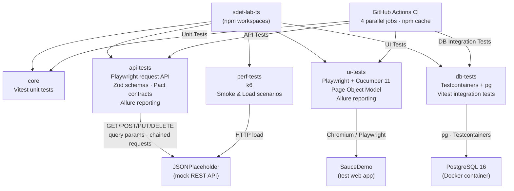

# sdet-lab-ts

A TypeScript/npm-workspaces mirror of [sdet-lab](https://github.com/Rav212mm/sdet-lab) — the same multi-layer test automation framework (unit, API, UI, DB, performance), reimplemented with the TypeScript test ecosystem instead of Java/Maven.

[](https://github.com/Rav212mm/sdet-lab-ts/actions/workflows/ci.yml)

---

## Architecture



---

## Tech Stack

| Layer | Technology | Version |
|---|---|---|
| Language | TypeScript | 5.7 |
| Workspaces | npm workspaces | — |
| Unit tests | Vitest | 2.1 |
| API tests | Playwright (`request` fixture) + Zod | 1.49 |
| Contract testing | Pact (consumer + provider) | 13.1 |
| UI tests | Playwright + Cucumber BDD | 1.49 / 11.1 |
| Test data | Faker (Data Factory) | 9.3 |
| DB integration | Testcontainers + `pg` | 10.28 / 8.13 |
| Reporting | Allure (cucumberjs / playwright) | 3.0 |
| Performance tests | k6 | — |
| CI/CD | GitHub Actions (matrix) | — |

---

## Project Structure

```
sdet-lab-ts/
├── core/                        # Business logic + Vitest unit tests
├── api-tests/                   # REST API tests (JSONPlaceholder)
│   ├── src/apiConfig.ts            #   single source of truth: API base URL + headers
│   ├── src/fixtures/apiClient.ts   #   shared Playwright APIRequestContext fixture
│   ├── src/schemas/postSchema.ts   #   Zod schemas (strict validation) — source of the Post type
│   ├── src/types/Post.ts           #   Post type (re-exported from the Zod schema)
│   ├── specs/api.spec.ts           #   GET/POST/PUT/DELETE + schema validation
│   ├── specs/posts.spec.ts         #   /posts resource tests
│   ├── specs/posts-advanced.spec.ts#   query params, chained requests, strict Zod schema
│   ├── specs/update-delete.spec.ts #   PUT/DELETE
│   └── specs/pact/                 #   consumer.spec.ts, provider.spec.ts
├── db-tests/                    # DB integration tests (Testcontainers + PostgreSQL)
│   ├── src/User.ts                 #   User type (id, name, email)
│   ├── src/UserRepository.ts       #   pg client operations
│   └── src/UserRepository.test.ts  #   3 integration tests with real PostgreSQL container
├── ui-tests/                    # UI tests: Playwright + Cucumber + Page Object Model
│   ├── src/pages/                  #   BasePage, LoginPage, InventoryPage, CartPage, CheckoutPage, SearchPage
│   ├── src/steps/                  #   step definitions
│   ├── src/hooks/                  #   Hooks (browser lifecycle, screenshot on failure)
│   ├── src/world/                  #   PlaywrightWorld — Cucumber World as IoC container
│   ├── src/model/                  #   SauceDemoUser (interface + Role enum), CheckoutData
│   ├── src/utils/                  #   config, TestDataFactory
│   └── features/                   #   login.feature, search.feature, shopping.feature, checkout.feature
└── perf-tests/                  # k6 performance tests
    └── posts-simulation.ts         #   smoke (1 VU) + load (ramp 50 VUs / 10s)
```

---

## Prerequisites

| Tool | Required for |
|---|---|
| Node.js 22+ | all modules |
| Docker | `db-tests` (Testcontainers PostgreSQL) |
| k6 | `perf-tests` |

Install everything from the repo root (npm workspaces resolve all module dependencies):

```bash
npm install
```

---

## Configuration (environment variables)

All have sensible defaults — override only when needed:

| Variable | Module | Default | Purpose |
|---|---|---|---|
| `BASE_URL` | ui-tests | `https://www.saucedemo.com/` | SauceDemo base URL |
| `HEADLESS` | ui-tests | `true` | set `false` for headed/debug runs |
| `API_BASE_URL` | api-tests | `https://jsonplaceholder.typicode.com` | REST API base URL (shared by config + request fixture) |
| `SCENARIO` | perf-tests | `smoke` | k6 scenario: `smoke` or `load` |

---

## How to Run Tests

**All modules (core + api + db + ui):**
```bash
npm test
```

**Single module:**
```bash
npm run test:core
npm run test:api
npm run test:db    # requires Docker running
npm run test:ui
```

**UI tests — tag filter:**
```bash
cd ui-tests
npm run test:smoke
npm run test:regression
```

**API tests — tag filter:** specs are tagged `@smoke` / `@regression` (via the Playwright `describe` options), so Playwright's `--grep` selects by tag:
```bash
npm run test -w api-tests -- --grep @smoke
npm run test -w api-tests -- --grep @regression
```

**UI tests — headed mode (debugging):**
```bash
HEADLESS=false npm run test -w ui-tests
```

**Performance tests:**
```bash
cd perf-tests
npm run build
npm run test:smoke   # 1 VU, 5 iterations
npm run test:load    # ramp to 50 VUs over 10s
```

---

## Viewing Reports

### Allure (API tests + UI tests)

Allure reports require a one-time CLI installation: [allure.qameta.io/allure2](https://allure.qameta.io/allure2/docs/latest/gettingstarted/installation/).

```bash
# API tests
cd api-tests && npm test && npm run report

# UI tests
cd ui-tests && npm test && npm run report
```

`npm run report` generates the report and opens it automatically in the browser.

---

### Playwright HTML report (API tests)

The `html` reporter is wired into `playwright.config.ts` (`open: 'never'`), so each API run writes `api-tests/playwright-report/` without auto-launching a browser. Open it on demand:

```bash
cd api-tests && npx playwright show-report
```

---

## CI/CD

### GitHub Actions (4 parallel jobs)

| Job | Module | What runs |
|---|---|---|
| Unit Tests | `core` | Vitest |
| API Tests | `api-tests` | Playwright request API + Pact |
| DB Integration Tests | `db-tests` | Testcontainers + PostgreSQL |
| UI Tests | `ui-tests` | Playwright + Cucumber (Chromium headless) |

- npm dependencies cached with `actions/cache` (via `setup-node` `cache: 'npm'`)
- `fail-fast: false` — all modules run even if one fails
- `CI Summary` job gates the overall result via `needs: test`
- `perf-tests` is intentionally excluded from CI (k6 binary not provisioned in the runner), same as Gatling in the Java original

---

## Test Data Factory

UI tests use a **Data Factory** pattern instead of static JSON files, eliminating data collisions in parallel test runs.

### SauceDemoUser — type-safe user lookup

```ts
// by role string (from Cucumber step)
const user = TestDataFactory.userForRole('standard');

// by enum constant
const user = TestDataFactory.userForRole(Role.LOCKED);
```

Available roles:

| Role enum | Username |
|---|---|
| `STANDARD` | `standard_user` |
| `LOCKED` | `locked_out_user` |
| `PROBLEM` | `problem_user` |
| `PERFORMANCE_GLITCH` | `performance_glitch_user` |
| `ERROR` | `error_user` |
| `VISUAL` | `visual_user` |

### CheckoutData — dynamic data with Faker

Each call generates a unique set — safe for parallel execution:

```ts
const data = TestDataFactory.randomCheckoutData();
// data.firstName  → e.g. "Emily"
// data.lastName   → e.g. "Hartmann"
// data.postalCode → e.g. "94102"
```

### Cucumber integration

Steps reference roles by name, not hardcoded credentials:

```gherkin
When the user logs in as "standard" role
```

The step resolves `"standard"` → `TestDataFactory.userForRole("standard")` at runtime.
